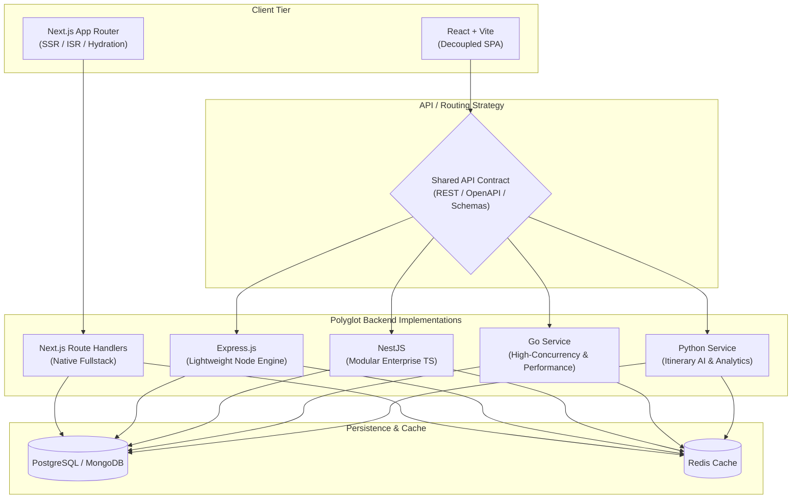

<div align="center">

# 🏔️ Nepalora — Polyglot Monorepo Platform

**An end-to-end Nepal Travel & Trekking Guide Platform engineered across multiple production stacks.**  
Designed to demonstrate architectural evolution, multi-language backend scalability, and clean code paradigms within a unified monorepo.

[](https://pnpm.io/)
[](https://nextjs.org/)
[](https://tailwindcss.com/)
[](#-apps--tech-stack-matrix)

[System Architecture](#system-architecture) •
[Reviewer Quick Guide](#-reviewer-quick-guide-start-here) •
[Apps & Stacks](#-apps--tech-stack-matrix) •
[Engineering Rationale](#-engineering-rationale) •
[Getting Started](#-getting-started)

---

</div>

## 📌 Executive Summary

**Nepalora** is a comprehensive travel guide and tour booking platform for trekking expeditions across the Himalayas (Annapurna, Everest, Langtang, etc.).

Rather than building a standard single-stack CRUD application, this project is built as a **Polyglot Monorepo** specifically crafted for technical evaluations and architectural reviews. It implements the **same business domain model** across progressive paradigms:

1. **Full-stack Monolith (Next.js App Router)**: Rapid delivery, SSR/SSG, Server Components, and zero-bundle server logic.
2. **Decoupled Client-Side App (React + Vite)**: SPA architecture with client state management and external API contracts.
3. **Enterprise Node.js Backend (Express.js & NestJS)**: Layered architecture, dependency injection, and scalable RESTful endpoints.
4. **High-Performance Concurrent Backend (Go)**: Low-latency API, strict memory safety, and Goroutine concurrency.
5. **Data & AI Backend (Python)**: Intelligent itinerary generator, recommendation engine, and data processing.

---

## 🧭 Reviewer Quick Guide (Start Here)

If you are evaluating this repository for a technical role, here is where to look based on your focus:

| Evaluation Focus               | Recommended Target Folder                      | What to Look For                                                                             |
| :----------------------------- | :--------------------------------------------- | :------------------------------------------------------------------------------------------- |
| **Full-Stack Next.js / React** | [`apps/next-fullstack`](./apps/next-fullstack) | App Router conventions, Server/Client components separation, Tailwind UI, responsive layouts |
| **SPA & Client Architecture**  | [`apps/react-vite`](./apps/react-vite)         | Component composition, clean state handling, modular CSS/Tailwind                            |
| **Enterprise TypeScript / DI** | [`apps/server-nest`](./apps/server-nest)       | Module boundaries, controllers/services, DTO validation, Clean Architecture                  |
| **Lightweight REST API**       | [`apps/server-express`](./apps/server-express) | Middleware pipeline, error handling, route structuring                                       |
| **High-Performance Services**  | [`apps/server-go`](./apps/server-go)           | Idiomatic Go, domain-driven package organization, concurrency patterns                       |
| **Data & AI / Algorithms**     | [`apps/server-python`](./apps/server-python)   | FastAPI asynchronous endpoints, data schemas (Pydantic), AI/recommendation logic             |
| **Monorepo & CI/CD Tooling**   | `packages/`, `pnpm-workspace.yaml`, `.github/` | Workspace caching, shared configurations, linting/formatting pipelines                       |

---

## 🏛️ System Architecture



---

## 🗂️ Apps & Tech Stack Matrix

| Directory                                      | Stack                                      | Role & Responsibility                                                                              | Port / Env | Status              |
| :--------------------------------------------- | :----------------------------------------- | :------------------------------------------------------------------------------------------------- | :--------- | :------------------ |
| [`apps/next-fullstack`](./apps/next-fullstack) | **Next.js 15, React 19, Tailwind CSS**     | Core showcase app; handles SEO-critical landing pages, tour catalogs, and initial full-stack flows | `3000`     | 🟢 Phase 1 (Active) |
| [`apps/react-vite`](./apps/react-vite)         | **React, Vite, TypeScript, Tailwind**      | Decoupled client application consuming standalone backend microservices                            | `5173`     | 🟡 Phase 2          |
| [`apps/server-express`](./apps/server-express) | **Express.js, TypeScript, Prisma/TypeORM** | Lightweight RESTful backend with middleware-centric authentication and routing                     | `4000`     | 🟡 Phase 3          |
| [`apps/server-nest`](./apps/server-nest)       | **NestJS, TypeScript, Class-Validator**    | Enterprise backend with Dependency Injection (IoC), Swagger, and Domain-Driven Design              | `4001`     | 🟡 Phase 4          |
| [`apps/server-go`](./apps/server-go)           | **Go (Golang), Gin/Fiber, GORM/pgx**       | Microservice handling high-throughput bookings, availability locking, and concurrency              | `8080`     | 🟡 Phase 5          |
| [`apps/server-python`](./apps/server-python)   | **Python 3.12, FastAPI, Pydantic**         | AI trekking assistant, weather forecast aggregator, and personalized itinerary generator           | `8000`     | 🟡 Phase 6          |
| `packages/*`                                   | **Shared Types, UI, Configs**              | Shared ESLint/Prettier configs, TypeScript schemas, and common data models                         | —          | 🔄 Integrated       |

---

## 💡 Engineering Rationale

### Why Port the Same Application Across Different Stacks?

1. **Showcase Architectural Flexibility**: Demonstrates understanding of how the same business domain (Tours, Trekking Guides, Bookings, Users) adapts to different paradigms: from functional Node.js routes to object-oriented NestJS, type-safe Go structs, and dynamic Python data pipelines.
2. **Performance Trade-Off Evaluation**: Provides concrete grounds to evaluate cold-starts, memory footprints, throughput, and CPU utilization across runtimes (Node.js vs. Go vs. Python).
3. **Production Simulation**: Simulates a real-world enterprise modernization path where a monolith initially built in Next.js evolves into specialized, decoupled microservices.

---

## 🏔️ Domain & Feature Scope

Nepalora models a real-world Himalayan expedition booking platform:

- **Expedition & Trekking Directory**: Multi-day itinerary details, difficulty ratings, peak altitude stats, and gear checklists.
- **Dynamic Filtering & Search**: Filter expeditions by region (Annapurna, Everest, Langtang), duration, season, and budget.
- **Booking & Availability Engine**: Date-slot reservation, group size constraints, and guide assignment.
- **Interactive Itineraries**: Daily route breakdowns with elevation profile mapping.
- **Trip Planner / AI Guide**: Tailored recommendations based on fitness level, duration, and target trekking month.

---

## 🚀 Getting Started

### Prerequisites

- **Node.js**: `>= 20.x`
- **pnpm**: `>= 9.x` (`corepack enable pnpm`)
- _(Optional for Backend Services)_: **Go** `>= 1.22`, **Python** `>= 3.11`, **Docker**

### 1. Clone & Install Dependencies

```bash
git clone https://github.com/<your-username>/nepalora.git
cd nepalora
pnpm install
```

### 2. Run the Development Server

You can run individual apps using standard pnpm workspace filter commands:

```bash
# 1. Run Next.js Fullstack (Primary Showcase)
pnpm dev:next

# 2. Or run via filter for any app
pnpm --filter next-fullstack dev
# pnpm --filter react-vite dev
# pnpm --filter server-express dev
# pnpm --filter server-nest start:dev
```

Open [http://localhost:3000](http://localhost:3000) to view the application in the browser.

### 3. Code Quality & Formatting

```bash
# Check code style across the workspace
pnpm format:check

# Auto-format all files
pnpm format
```

---

<div align="center">
  <sub>Built with passion for high standards in software architecture and the Himalayas.</sub>
</div>
